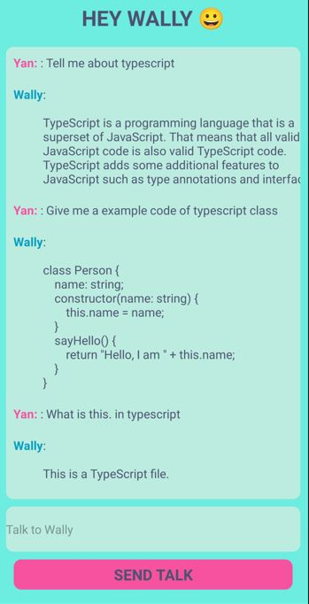

# ReactNative-GPT-API-myChatbot

this training, followed from Youtuber [Bug Ninza](https://www.youtube.com/watch?v=tdxgG9Gq41A&t=1s&ab_channel=BugNinza)

Tech covered

- react native & expo
- axios library
- OpenAI API connect
- Use of react native hook like, useState
- Use of Flatlist, TextInput, and Touchable Opacity

## Running the Audio App

Put in your apiKey = "GPT_PERSONAL_APIKEY";

Run

```
npx expo start
```
### see demo

